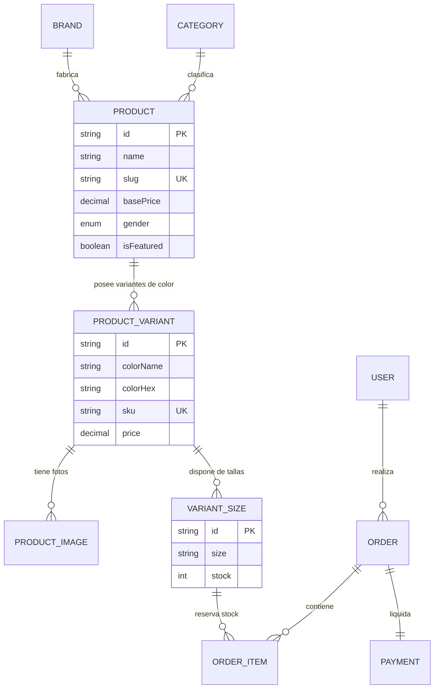

# 👟 SOLES — Modern Sneaker Vault E-Commerce Platform

Plataforma de comercio electrónico de alto rendimiento para la compra y venta de zapatillas (sneakers) de colección y edición limitada. Diseñada bajo una arquitectura modular limpia, completamente responsive, con renderizado híbrido (SSR/ISR) y optimizada para SEO y velocidad.


---

## ✨ Características Principales

- **🔥 Landing Page de Alto Impacto (`/`)**:
  - Hero Section dinámico con lanzamiento destacado (Drop Exclusivo), especificaciones y navegación directa.
  - Accesos rápidos a marcas y siluetas legendarias (Jordan Retro, Nike Dunks, New Balance, Adidas Originals).
  - Secciones automáticas de *Novedades* y *Más Vendidos*.
  - Banner informativo de autenticidad garantizada y suscripción VIP.

- **🎯 Catálogo con Filtrado Reactivo Multidimensional (`/productos`)**:
  - Barra lateral de filtros instantáneos por **Marca** (checkboxes con contador), **Talla US** (matriz de botones pill), **Género** (Hombre, Mujer, Unisex, Niños), **Rango de Precio** (slider interactivo), **Paleta de Colores** (swatches visuales) y filtro de **Solo con stock disponible**.
  - Sincronización en memoria con estado reactivo global (Zustand).
  - Barra de chips de filtros activos con eliminación individual y botón de *Limpiar todo*.
  - Selector de ordenamiento (Destacados, Nuevos Lanzamientos, Precio: menor a mayor, Precio: mayor a menor).
  - Drawer móvil flotante y accesible para pantallas reducidas.

- **👟 Tarjeta de Producto Interactiva (`ProductCard`)**:
  - Selector de variantes de color mediante paleta de puntos (dots): conmuta la imagen principal de la zapatilla en tiempo real al hacer clic.
  - Efecto hover con imagen secundaria del calzado.
  - Badges dinámicos de *Novedad*, *Descuento porcentual* y *Agotado*.
  - Botón de compra rápida con microinteracción visual de confirmación (`Check` animado).
  - Botón de lista de deseos (*Wishlist*) con icono reactivo.

- **🛍️ Drawer de Carrito Interactivo (`CartDrawer`)**:
  - Panel deslizante lateral persistido automáticamente en `localStorage`.
  - Barra de progreso dinámica para **Envío Exprés Gratuito** (meta de $150).
  - Control granular de cantidades (`+` / `-`) respetando el límite de stock por talla.
  - Resumen en vivo de subtotal, costo de envío y cálculo total.

- **🔍 Ficha Detallada de Producto (`/productos/[slug]`)**:
  - Renderizado en servidor con metadatos SEO dinámicos y OpenGraph.
  - Galería interactiva con miniaturas navegables.
  - Matriz de selección de tallas con indicación de stock en tiempo real (*"¡Solo 2 unidades!"* o *"Disponible para despacho inmediato"*).
  - Modal interactivo de **Guía de Tallas** con tabla de equivalencias internacionales (US Hombre, US Mujer, EU, Longitud en CM).
  - Acordeón de especificaciones técnicas y materiales.
  - Carrusel de zapatillas relacionadas por marca o categoría.

---

## 🛠️ Stack Tecnológico

| Capa | Tecnologías |
| :--- | :--- |
| **Frontend Framework** | [Next.js 15](https://nextjs.org/) (App Router, Server & Client Components) |
| **Biblioteca de UI** | [React 19](https://react.dev/) |
| **Lenguaje** | [TypeScript 5](https://www.typescriptlang.org/) (Tipado estricto) |
| **Estilos & CSS** | [Tailwind CSS v4](https://tailwindcss.com/) |
| **Iconografía** | [Lucide React](https://lucide.dev/) |
| **Gestión de Estado** | [Zustand](https://zustand-demo.pmnd.rs/) (con middleware `persist`) |
| **Base de Datos & ORM** | [PostgreSQL](https://www.postgresql.org/) + [Prisma ORM 6](https://www.prisma.io/) |
| **Contenedorización** | [Docker](https://www.docker.com/) + Docker Compose (Multi-stage build) |

---

## 📂 Estructura del Proyecto

El código sigue una arquitectura modular limpia orientada a características de negocio (**Feature-Driven Architecture**):

```text
├── prisma/
│   └── schema.prisma            # Esquema relacional (Productos, Variantes, Tallas, Stock)
├── public/                      # Recursos estáticos
├── src/
│   ├── app/                     # Rutas y páginas (Next.js App Router)
│   │   ├── layout.tsx           # Root Layout con Navbar, CartDrawer y Footer
│   │   ├── page.tsx             # Landing Page (Hero, Categorías, Drops)
│   │   ├── globals.css          # Estilos globales y Tailwind CSS
│   │   └── productos/
│   │       ├── page.tsx         # Catálogo completo con filtros
│   │       └── [slug]/
│   │           └── page.tsx     # Ficha de producto con SEO dinámico
│   ├── components/              # Componentes UI transversales
│   │   ├── cart/
│   │   │   └── CartDrawer.tsx   # Drawer interactivo del carrito
│   │   ├── layout/
│   │   │   ├── Navbar.tsx       # Barra de navegación superior
│   │   │   └── Footer.tsx       # Pie de página y newsletter
│   │   └── products/
│   │       └── ProductCard.tsx  # Tarjeta de producto con cambio de color en vivo
│   ├── data/
│   │   └── mockSneakers.ts      # Catálogo de zapatillas icónicas listas para usar
│   ├── features/
│   │   ├── catalog/             # Módulo de catálogo y filtros
│   │   │   └── components/
│   │   │       ├── CatalogSection.tsx
│   │   │       └── ProductFilters.tsx
│   │   └── products/            # Módulo de detalle de producto
│   │       └── components/
│   │           └── ProductDetailView.tsx
│   ├── lib/
│   │   ├── prisma.ts            # Cliente singleton de Prisma
│   │   └── utils.ts             # Utilidades (formato de moneda, cálculo de descuentos)
│   ├── store/
│   │   ├── useCartStore.ts      # Store global del carrito (persistido)
│   │   └── useFilterStore.ts    # Store global reactivo para filtros
│   └── types/
│       ├── cart.ts              # Tipos del carrito de compras
│       └── product.ts           # Modelos de dominio de zapatillas
├── Dockerfile                   # Construcción multi-stage optimizada (standalone)
├── docker-compose.yml           # Orquestación de App + Base de Datos PostgreSQL
├── .dockerignore                # Archivos ignorados por Docker
├── .env.example                 # Variables de entorno de ejemplo
├── next.config.ts               # Configuración de dominios de imágenes y standalone
└── tsconfig.json                # Configuración de TypeScript
```

---

## 🐳 Ejecución con Docker (Recomendado para cualquier equipo)

Gracias a Docker y Docker Compose, puedes levantar toda la aplicación junto a su base de datos PostgreSQL en **cualquier sistema operativo (Windows, macOS, Linux)** sin necesidad de instalar Node.js ni PostgreSQL localmente.

### Prerrequisitos
- Tener instalado [Docker Desktop](https://www.docker.com/products/docker-desktop/) y en ejecución.

### 1. Iniciar los contenedores
Ejecuta en la raíz del proyecto:

```bash
docker compose up --build
```

Esto descargará la imagen de PostgreSQL 16, construirá la imagen optimizada de Next.js mediante el `Dockerfile` multi-stage y levantará ambos servicios.

### 2. Abrir en el navegador
Una vez iniciado, abre:
- **Tienda**: [http://localhost:3000](http://localhost:3000)
- **Base de Datos PostgreSQL**: `localhost:5432` (Usuario: `postgres`, Password: `postgres`, DB: `zapatillas_db`)

### 3. Sincronizar el esquema de base de datos (Opcional)
Para aplicar las tablas del archivo `schema.prisma` en el contenedor de PostgreSQL:

```bash
docker compose exec app npx prisma db push
```

### 4. Detener los contenedores
Para detener y apagar los servicios:

```bash
docker compose down
```

*(Los datos de la base de datos se conservan gracias al volumen persistente `postgres_data`).*

---

## 💻 Ejecución Local (Sin Docker)

Si prefieres correr el proyecto directamente con Node.js en tu máquina:

### Prerrequisitos
- [Node.js](https://nodejs.org/) v18.18+ o v20+
- Gestor de paquetes `npm` (o `pnpm` / `yarn`)

### 1. Clonar el repositorio
```bash
git clone https://github.com/tu-usuario/zapatillas-store.git
cd zapatillas-store
```

### 2. Instalar dependencias
```bash
npm install
```

### 3. Configurar variables de entorno
Crea tu archivo `.env` tomando como base el archivo `.env.example`:

```bash
cp .env.example .env
```

### 4. Generar el cliente de Prisma
```bash
npx prisma generate
```

### 5. Iniciar el servidor de desarrollo
```bash
npm run dev
```

Abre [http://localhost:3000](http://localhost:3000) en tu navegador.

---

## 🗄️ Modelo de Base de Datos Relacional

El modelo en `prisma/schema.prisma` resuelve de forma eficiente la estructura de calzado deportivo:



---

## 📜 Scripts Disponibles

En el directorio del proyecto puedes ejecutar:

| Comando | Acción |
| :--- | :--- |
| `npm run dev` | Inicia el servidor local de desarrollo con recarga en caliente en el puerto `3000`. |
| `npm run build` | Compila la aplicación para producción y valida los tipos de TypeScript. |
| `npm run start` | Arranca el servidor de producción compilado. |
| `npm run lint` | Ejecuta el linter ESLint para análisis de código. |
| `npx prisma studio` | Abre una interfaz gráfica en el navegador para explorar la base de datos. |

---

## 📄 Licencia

Este proyecto está bajo la Licencia [MIT](LICENSE). Puedes utilizarlo libremente para proyectos personales o comerciales.
